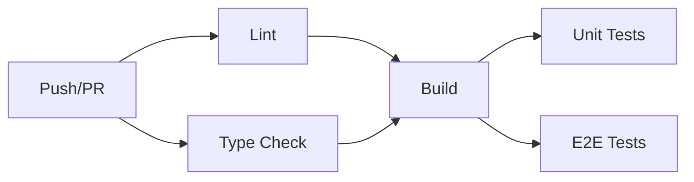

# Lake Surface Water Temperature Playground

A comprehensive platform for analyzing lake surface water temperature (LSWT) data with mutation detection algorithms and segmentation analysis.

## Features

- **Mutation Detection**: Pettitt test, sequential t-test with OLS and Sen's slope
- **Segmentation Analysis**: Custom break years and statistical comparison
- **Interactive Visualization**: Plotly charts with dark mode support
- **Documentation**: Built with Nuxt Content
- **Presentations**: Group meeting slides integration

## Tech Stack

- **Framework**: Nuxt 3 + Nitro
- **UI**: Vue 3 + UnoCSS
- **Charts**: Plotly.js
- **Testing**: Vitest + Playwright
- **CI/CD**: GitHub Actions
- **Package Manager**: pnpm with catalogs

## Development Workflow

### Prerequisites

- Node.js LTS
- pnpm 10.x

### Installation

```bash
# Clone the repository
git clone git@github.com:0froq/lswt-playground.git
cd lswt-playground

# Install dependencies
pnpm install

# Setup git hooks
pnpm prepare
```

### Development

```bash
# Start development server
pnpm dev

# Start with PWA enabled
pnpm dev:pwa

# Type check
pnpm typecheck

# Lint
pnpm lint

# Lint and fix
pnpm lint:fix
```

### Testing

We use **Vitest** for unit testing and **Playwright** for E2E testing.

```bash
# Run unit tests
pnpm test:unit

# Run unit tests with UI
pnpm test:ui

# Run unit tests with coverage
pnpm test:coverage

# Run E2E tests
pnpm test:e2e

# Run E2E tests with UI
pnpm test:e2e:ui

# Debug E2E tests
pnpm test:e2e:debug

# Run all tests
pnpm test
```

#### Test Structure

```
tests/
├── unit/           # Unit tests (Vitest)
│   └── composables/
├── e2e/            # E2E tests (Playwright)
│   └── *.spec.ts
└── utils/          # Test utilities
```

### Building

```bash
# Build for production
pnpm build

# Generate static site
pnpm generate

# Preview production build
pnpm preview
```

### Git Workflow

We use **Conventional Commits** with the following types:

> [!NOTE] Attention:
> No `chore` allowed. Use `build` for build-related changes and `ci` for CI/CD changes instead.

- `feat`: New feature
- `fix`: Bug fix
- `docs`: Documentation changes
- `style`: Code style changes (formatting, semicolons, etc)
- `refactor`: Code refactoring
- `perf`: Performance improvements
- `test`: Adding or updating tests
- `build`: Build system changes
- `ci`: CI/CD changes

#### Pre-commit Hooks

The following checks run automatically on pre-commit:

1. **Lint**: ESLint checks and auto-fixes
2. **Type Check**: TypeScript validation
3. **Format**: Prettier formatting for JSON and Markdown files

Hooks are managed by `simple-git-hooks` and configured in `.simple-git-hooks.json`.

#### Commit Message Format

```
<type>(<scope>): <subject>

<body>

<footer>
```

Example:
```
feat(playground): add mutation detection tool

Implement Pettitt test and sequential t-test for detecting
significant change points in lake temperature time series.

Closes #123
```

### Release Process

We use `changelogen` for automated changelog generation and versioning.

```bash
# Preview changelog
pnpm changelog:preview

# Bump version (patch)
pnpm release:patch

# Bump version (minor)
pnpm release:minor

# Bump version (major)
pnpm release:major

# Prerelease (alpha/beta/rc)
pnpm release:alpha
pnpm release:beta
pnpm release:rc
```

## Project Structure

```
.
├── app/
│   ├── components/       # Vue components
│   ├── composables/      # Vue composables
│   ├── layouts/          # Nuxt layouts
│   ├── pages/            # Nuxt pages
│   ├── types/            # TypeScript types
│   └── utils/            # Utility functions
├── content/              # Nuxt Content
│   ├── docs/            # Documentation
│   └── slides/          # Group meeting slides
├── public/              # Static assets
├── server/              # Nitro server
│   └── api/            # API routes
├── tests/               # Test files
│   ├── unit/           # Unit tests
│   └── e2e/            # E2E tests
├── .github/             # GitHub Actions
│   └── workflows/      # CI/CD workflows
└── scripts/             # Build/release scripts
```

## Routes

| Route | Description |
|-------|-------------|
| `/` | Documentation homepage |
| `/playground` | Tool selection entry |
| `/playground/mutation` | Mutation detection tool |
| `/playground/segments` | Segmentation analysis tool |
| `/docs/**` | Documentation pages |
| `/slides/**` | Group meeting slides |

## CI/CD Pipeline

The CI pipeline runs on every push and pull request to `main`:

1. **Lint**: ESLint validation
2. **Type Check**: TypeScript type checking
3. **Build**: Production build verification
4. **Unit Tests**: Vitest unit tests with coverage
5. **E2E Tests**: Playwright E2E tests

### Workflow Stages



## Environment Variables

Create a `.env` file for local development:

```bash
# Development
NUXT_PUBLIC_API_BASE_URL=http://localhost:3000

# Testing (for E2E)
BASE_URL=http://localhost:3000
```

## Contributing

1. Fork the repository
2. Create a feature branch: `git checkout -b feat/my-feature`
3. Make your changes
4. Run tests: `pnpm test`
5. Commit with conventional commits: `git commit -m "feat: add feature"`
6. Push to your fork: `git push origin feat/my-feature`
7. Open a Pull Request

## License

MIT

## Acknowledgments

- Group meeting slides from [sliders-groupmeeting](https://github.com/0froq/sliders-groupmeeting)
- Plotly.js for interactive visualizations
- Nuxt team for the amazing framework
